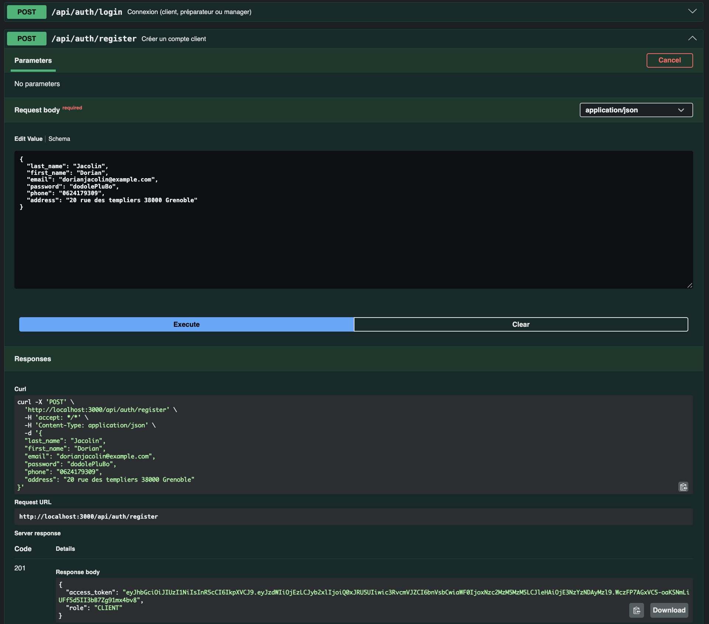
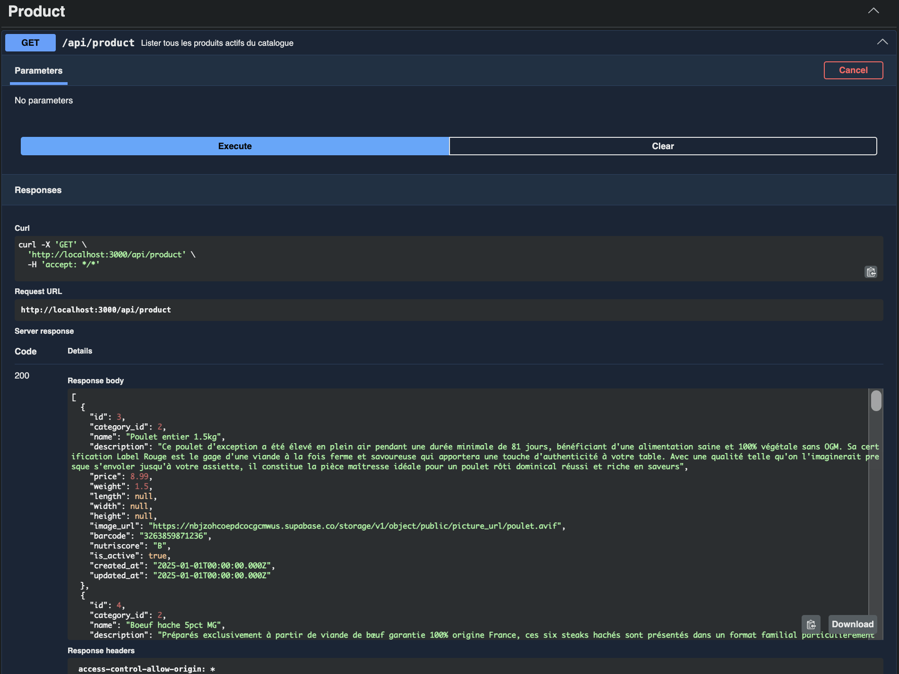
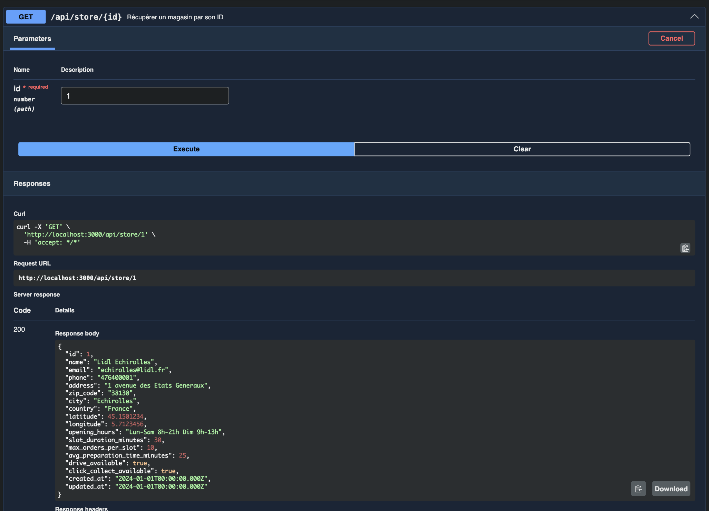
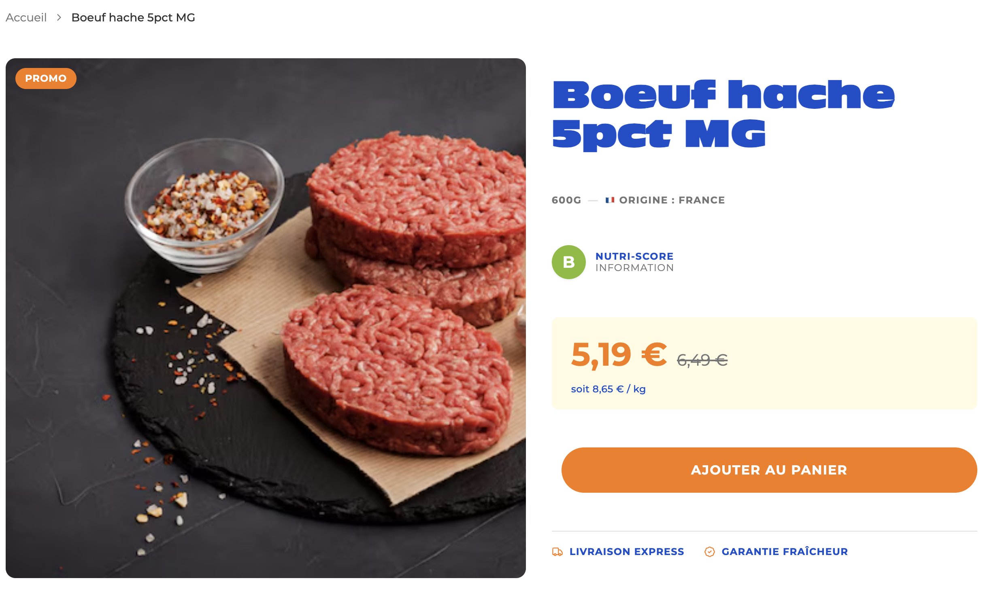
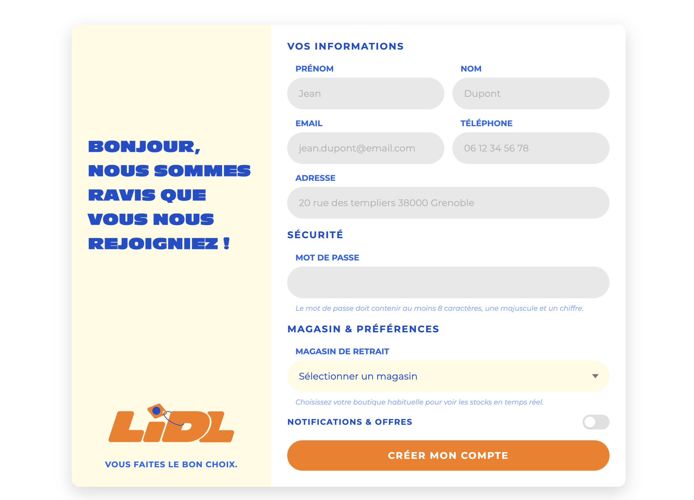

# Rapport Backend – Lidl Drive (Click & Collect)

**Auteur** : Dorian Jacolin  
**Projet** : Back-lidl – API REST NestJS  
**École** : My Digital School  
**Date** : Avril 2026

**Lien GitHub** : [github.com/Jacma-pro/back-lidl](https://github.com/Jacma-pro/back-lidl)

---

## 1. Présentation rapide du projet

La solution **Lidl Collect** est une WebApp de **Drive et Click & Collect** conçue en réponse à l'appel d'offre de Lidl France. Elle s'inscrit dans la stratégie de repositionnement "discount-premium" de l'enseigne et permet de combler les attentes d'une clientèle exigeante en termes de fluidité. L'application couvre l'intégralité du parcours de commande et propose deux modes de retrait : un mode piéton (Click & Collect sur comptoir dédié) et un mode Drive (retrait voiture par scan de QR code). L'application distingue trois types d'utilisateurs finaux : le **client**, le **préparateur de commandes** (OPERATOR) sous pression, et le **gérant de magasin** (MANAGER) qui supervise l'activité.

Ma contribution couvre l'ensemble de la **partie backend** : conception d'une architecture REST robuste (critique pour la fiabilité en temps réel des stocks et du retrait), développement des modules métier, mise en place de l'authentification, documentation de l'API, et synchronisation avec le frontend. J'ai également participé à la **conception du schéma de base de données** transactionnelles en collaboration avec l'équipe, ainsi qu'à la mise en place du **Dockerfile** pour garantir un déploiement fiable et paritaire entre les environnements avec les autres membres du groupe.

En parallèle, j'ai assuré **l'intégration frontend** : connexion de l'API à l'application React, création et adaptation de plusieurs pages et composants, ainsi que la mise en place du système d'authentification côté client.

---

## 2. Stack technique

| Élément | Technologie | Rôle |
|--------|-------------|------|
| Framework | NestJS 11 (TypeScript) | Serveur HTTP, architecture modulaire |
| Base de données | PostgreSQL via Supabase | Persistence des données cloud |
| ORM | TypeORM 0.3 | Mapping objet-relationnel, entités |
| Authentification | JWT + Passport.js | Sécurisation des routes |
| Hachage | bcrypt (coût 10) | Sécurisation des mots de passe |
| Documentation API | Swagger / OpenAPI | Interface interactive de test |
| Validation | class-validator / class-transformer | Validation des corps de requête |
| Configuration | @nestjs/config | Gestion des variables d'environnement |
| Conteneurisation | Docker (Node 24 Alpine) | Déploiement (en collaboration) |

---

## 3. Initialisation et configuration du projet

### Bootstrapping (`src/main.ts`)

Le point d'entrée de l'application configure plusieurs éléments globaux :

```typescript
async function bootstrap() {
  const app = await NestFactory.create(AppModule);

  // Préfixe global : tous les endpoints sont sous /api
  app.setGlobalPrefix('api');

  // Validation globale des corps de requête
  app.useGlobalPipes(new ValidationPipe({
    whitelist: true,              // Ignore les champs non déclarés
    forbidNonWhitelisted: true,   // Lève une erreur si un champ inconnu est envoyé
    transform: true,              // Transforme automatiquement les types (string → number, etc.)
  }));

  // Configuration Swagger avec support Bearer Token
  const config = new DocumentBuilder()
    .setTitle('Lidl Drive API')
    .setDescription('API du projet Drive Click & Collect')
    .setVersion('1.0')
    .addBearerAuth()
    .build();
  SwaggerModule.setup('docs', app, document);

  // CORS activé pour permettre les requêtes depuis le frontend
  app.enableCors();

  await app.listen(port);
}
```

Le `ValidationPipe` global avec `whitelist: true` protège l'API contre les injections de champs non attendus. L'option `transform: true` permet de recevoir des paramètres de route sous forme de `number` directement sans conversion manuelle.

### Configuration de la base de données

La connexion à **Supabase** (PostgreSQL managé) a nécessité plusieurs ajustements spécifiques au cloud :

```typescript
TypeOrmModule.forRootAsync({
  useFactory: (configService: ConfigService) => ({
    type: 'postgres',
    url: configService.get('DATABASE_URL'),
    ssl: { rejectUnauthorized: false },  // Certificat Supabase auto-signé
    extra: { family: 4 },               // Forcer IPv4 pour éviter les timeouts
    synchronize: false,                  // Le schéma est géré manuellement
    entities: [...],
  }),
})
```

`synchronize: false` est un choix délibéré : cela signifie que les migrations de schéma sont effectuées manuellement sur Supabase, ce qui évite tout risque d'altération involontaire de données en production.

---

## 4. Architecture modulaire

Le projet suit l'architecture **modulaire de NestJS** : chaque domaine métier dispose de son propre dossier avec quatre fichiers distincts – `module`, `controller`, `service`, `entity`. Cette séparation des responsabilités permet une maintenance et une évolution indépendante de chaque fonctionnalité.

```
src/
├── auth/                   Controller + Service + Module + Stratégie JWT
├── products/               Catalogue produits
├── categories/             Catégories de produits
├── stores/                 Points de vente (adresse, géoloc, horaires)
├── client/                 Clients (compte, historique)
├── preparer/               Préparateurs de commandes
├── manager/                Gérants de magasin
├── permission/             Rôles utilisateurs
├── cart/                   Panier d'achat
├── cart-item/              Lignes de panier
├── order/                  Commandes
├── order-item/             Lignes de commande
├── pickup-slot/            Créneaux de retrait en magasin
├── payment/                Paiements
├── substitution-proposal/  Substitutions en cas de rupture
├── stock/                  Stocks par magasin et par produit
├── schedule/               Planning des préparateurs
├── performance/            Métriques de performance du personnel
├── notification/           Notifications (email / SMS / push)
├── audit-log/              Journal d'audit
├── client-account/         Statut et activation du compte client
├── client-history/         Fidélité et historique des achats
└── common/
    ├── guards/             JwtAuthGuard, RolesGuard
    └── decorators/         @Roles()
```

**22 modules** ont été développés, couvrant l'intégralité du périmètre fonctionnel de l'application.

---

## 5. Conception de la base de données

En collaboration avec l'équipe, j'ai participé à la **conception du schéma relationnel** de l'application. Les entités TypeORM que j'ai développées reflètent ce schéma. Voici le détail par domaine :

### Domaine Utilisateurs

**`permission`** – Table de référence des rôles
- `id`, `role` (enum : CLIENT | OPERATOR | MANAGER | ADMIN), `created_at`, `updated_at`

**`client`** – Clients de la plateforme
- `id`, `permission_id` (FK), `last_name`, `first_name`, `email` (unique), `password` (haché bcrypt), `phone`, `address`, `preferred_store_id` (nullable), `created_at`, `updated_at`

**`preparer`** – Préparateurs de commandes, rattachés à un magasin
- `id`, `permission_id` (FK), `store_id` (FK), `first_name`, `last_name_initials`, `work_email` (unique), `password` (haché), `work_phone`, `created_at`, `updated_at`

**`manager`** – Gérants, rattachés à un magasin
- `id`, `permission_id` (FK), `store_id` (FK), `first_name`, `last_name_initials`, `work_email` (unique), `password` (haché), `work_phone`, `created_at`, `updated_at`

**`client_account`** – Statut du compte client
- `id`, `client_id` (FK), `is_verified` (default false), `is_active` (default true), `last_login_at` (nullable), `created_at`, `updated_at`

**`client_history`** – Programme de fidélité
- `id`, `client_id` (FK), `loyalty_points` (default 0), `loyalty_status` (default false), `created_at`, `updated_at`

### Domaine Magasins & Catalogue

**`store`** – Points de vente physiques
- `id`, `name`, `email`, `phone`, `address`, `zip_code`, `city`, `country`, `latitude`, `longitude`, `opening_hours` (nullable), `slot_duration_minutes`, `max_orders_per_slot`, `avg_preparation_time_minutes`, `drive_available`, `click_collect_available`, `created_at`, `updated_at`

**`category`** – Catégories de produits
- `id`, `name`, `restrictions` (JSON nullable), `description` (nullable)

**`product`** – Catalogue produits
- `id`, `category_id` (FK), `name`, `description`, `price` (decimal), `weight`, `length`, `width`, `height`, `image_url`, `barcode`, `nutriscore`, `is_active` (default true), `created_at`, `updated_at`

**`stock`** – Stock par magasin et par produit
- `id`, `store_id` (FK), `product_id` (FK), `available_quantity` (default 0), `updated_at`

### Domaine Commandes & Commerce

**`cart`** – Panier d'achat
- `id`, `client_id` (FK), `store_id` (FK), `status` (enum : ACTIVE | ABANDONED | CONVERTED), `created_at`, `updated_at`

**`cart_item`** – Articles dans le panier
- `id`, `cart_id` (FK), `product_id` (FK), `quantity`, `unit_price` (decimal)

**`pickup_slot`** – Créneaux de retrait disponibles
- `id`, `store_id` (FK), `date`, `start_time`, `end_time`, `max_orders`, `current_orders` (default 0), `is_available` (default true)

**`order`** – Commandes validées
- `id`, `client_id` (FK), `store_id` (FK), `pickup_slot_id` (FK), `preparer_id` (FK nullable), `status` (enum : PENDING | IN_PROGRESS | READY | PICKED_UP | CANCELLED), `total_price` (decimal), `pickup_code`, `created_at`, `updated_at`

**`order_item`** – Lignes d'une commande
- `id`, `order_id` (FK), `product_id` (FK), `quantity`, `unit_price` (decimal), `substitution_id` (FK nullable)

**`substitution_proposal`** – Substitutions en cas de rupture
- `id`, `order_item_id` (FK), `original_product_id` (FK), `proposed_product_id` (FK), `status` (enum : PENDING | ACCEPTED | REFUSED), `created_at`

**`payment`** – Suivi des paiements
- `id`, `order_id` (FK), `amount` (decimal), `method` (enum : IN_STORE | SIMULATED_ONLINE), `status` (enum : PENDING | VALIDATED | REFUNDED), `transaction_ref` (nullable), `created_at`

### Domaine Opérations & Système

**`schedule`** – Plannings des préparateurs
- `id`, `preparer_id` (FK), `store_id` (FK), `date`, `start_time`, `end_time`, `status` (enum : PRESENT | ABSENT | ON_LEAVE), `comment` (nullable), `created_at`, `updated_at`

**`performance`** – Métriques de performance du personnel
- `id`, `preparer_id` (FK), `orders_prepared_count`, `avg_preparation_time` (float), `error_rate` (float), `stock_shortages_reported`, `global_score` (float), `period_start_date`, `period_end_date`, `created_at`

**`notification`** – Notifications envoyées aux clients
- `id`, `client_id` (FK), `order_id` (FK nullable), `type` (enum : CONFIRMATION | READY | CANCELLATION | SUBSTITUTION), `channel` (enum : EMAIL | SMS | PUSH), `status` (enum : PENDING | SENT | FAILED), `sent_at` (nullable), `created_at`

**`audit_log`** – Journal d'audit système
- `id`, `actor_id`, `actor_role`, `action`, `target_table`, `target_id` (nullable), `ip_address`, `created_at`

---

## 6. Système d'authentification

L'authentification est un des éléments centraux que j'ai développés. Elle repose sur **JWT (JSON Web Tokens)** combiné à **Passport.js** via `@nestjs/passport`.

### Flux de connexion

La méthode `login` du `AuthService` interroge séquentiellement les trois tables utilisateurs :

```typescript
async login(email: string, password: string) {
  // 1. Cherche dans les clients
  const client = await this.clientService.findByEmail(email);
  if (client) {
    const valid = await bcrypt.compare(password, client.password);
    if (!valid) throw new UnauthorizedException('Identifiants invalides');
    return this.generateToken(client.id, 'CLIENT', client.preferred_store_id ?? null);
  }

  // 2. Cherche dans les préparateurs
  const preparer = await this.preparerService.findByWorkEmail(email);
  if (preparer) {
    const valid = await bcrypt.compare(password, preparer.password);
    if (!valid) throw new UnauthorizedException('Identifiants invalides');
    return this.generateToken(preparer.id, 'OPERATOR', preparer.store_id);
  }

  // 3. Cherche dans les managers
  const manager = await this.managerService.findByWorkEmail(email);
  if (manager) {
    const valid = await bcrypt.compare(password, manager.password);
    if (!valid) throw new UnauthorizedException('Identifiants invalides');
    return this.generateToken(manager.id, 'MANAGER', manager.store_id);
  }

  throw new UnauthorizedException('Identifiants invalides');
}
```

Ce design permet à un seul endpoint `/api/auth/login` de servir tous les profils d'utilisateurs, sans que le client n'ait à préciser son type. La logique est entièrement côté serveur.

### Inscription

L'inscription est réservée aux clients. Le mot de passe est **haché avec bcrypt** avant toute persistance en base :

```typescript
const hashed = await bcrypt.hash(input.password, 10); // coût 10
const client = await this.clientService.create({ ...input, password: hashed });
return this.generateToken(client.id, 'CLIENT', null);
```

Un `ConflictException` (HTTP 409) est levé si l'adresse email est déjà utilisée.

### Token JWT

```typescript
private generateToken(userId: number, role: 'CLIENT' | 'OPERATOR' | 'MANAGER' | 'ADMIN', storeId: number | null) {
  const expiresIn = role === 'ADMIN' ? '10m' : '15m';
  const payload = { sub: userId, role, storeId };
  return {
    access_token: this.jwtService.sign(payload, { expiresIn }),
    role,
  };
}
```

Le payload contient :
- `sub` : identifiant de l'utilisateur
- `role` : rôle (CLIENT, OPERATOR, MANAGER, ADMIN)
- `storeId` : identifiant du magasin (utile pour les OPERATOR et MANAGER, `null` pour les clients)

### Guards de sécurité

J'ai développé deux guards dans `src/common/guards/` :

**`JwtAuthGuard`** – vérifie la validité du token sur toutes les routes protégées :
```typescript
@Injectable()
export class JwtAuthGuard extends AuthGuard('jwt') {}
```

**`RolesGuard`** – vérifie que le rôle de l'utilisateur connecté correspond au(x) rôle(s) requis par la route :
```typescript
@Injectable()
export class RolesGuard implements CanActivate {
  canActivate(context: ExecutionContext): boolean {
    const required = this.reflector.getAllAndOverride<Role[]>(ROLES_KEY, [
      context.getHandler(), context.getClass(),
    ]);
    if (!required || required.length === 0) return true;

    const { user } = context.switchToHttp().getRequest();
    if (!required.includes(user?.role)) {
      throw new ForbiddenException('Accès refusé : rôle insuffisant');
    }
    return true;
  }
}
```

**`@Roles()` décorateur** – permet d'annoter les routes avec les rôles autorisés :
```typescript
@Roles('MANAGER', 'ADMIN')
@UseGuards(JwtAuthGuard, RolesGuard)
@Get('/sensitive')
getSensitiveData() { ... }
```

---

## 7. Développement des modules et endpoints

Chaque module suit le même pattern : `Controller` → `Service` → `Entity`. Voici comment cela se présente concrètement pour quelques modules représentatifs.

### Exemple : module Product

Le controller produit illustre la structure typique avec validation des paramètres, documentation Swagger et séparation des responsabilités :

```typescript
@ApiTags('Product')
@Controller('product')
export class ProductsController {

  @Get()
  @ApiOperation({ summary: 'Lister tous les produits actifs du catalogue' })
  @ApiResponse({ status: 200, description: 'Liste des produits retournée' })
  findAll() {
    return this.productsService.findAll();
  }

  @Get(':id')
  @ApiOperation({ summary: 'Récupérer un produit par son ID' })
  @ApiParam({ name: 'id', example: 1 })
  @ApiResponse({ status: 404, description: 'Produit introuvable' })
  findOne(@Param('id', ParseIntPipe) id: number) {
    return this.productsService.findOne(id);
  }

  @Post()
  @ApiOperation({ summary: 'Créer un produit' })
  create(@Body() body: { category_id: number; name: string; price: number; ... }) {
    return this.productsService.create(body);
  }
}
```

`ParseIntPipe` assure la conversion et la validation du paramètre de route `:id` avant qu'il n'arrive dans le service.

### Exemple : module Cart

Le panier illustre la gestion des statuts typés et la structure du corps de requête :

```typescript
@Post()
create(@Body() body: {
  client_id: number;
  store_id: number;
  status?: 'ACTIVE' | 'ABANDONED' | 'CONVERTED'
}) {
  return this.cartService.create(body);
}
```

### Exemple : module Order

La commande est l'entité la plus riche, avec plusieurs relations et une énumération de statuts représentant le cycle de vie complet :

```typescript
@Post()
create(@Body() body: {
  client_id: number;
  store_id: number;
  pickup_slot_id: number;
  preparer_id?: number | null;
  status?: 'PENDING' | 'IN_PROGRESS' | 'READY' | 'PICKED_UP' | 'CANCELLED';
  total_price: number;
  pickup_code: string;
}) {
  return this.orderService.create(body);
}
```

### Tableau complet des endpoints

Plus de **60 endpoints REST** ont été développés :

| Module | GET liste | GET par ID | POST création |
|--------|-----------|-----------|--------------|
| Auth | – | – | `/auth/login`, `/auth/register` |
| Product | `/product` | `/product/:id` | `/product` |
| Category | `/category` | `/category/:id` | `/category` |
| Store | `/store` | `/store/:id` | `/store` |
| Stock | `/stock` | `/stock/:id` | `/stock` |
| Client | `/client` | `/client/:id` | `/client` |
| Preparer | `/preparer` | `/preparer/:id` | `/preparer` |
| Manager | `/manager` | `/manager/:id` | `/manager` |
| Permission | `/permission` | `/permission/:id` | `/permission` |
| Cart | `/cart` | `/cart/:id` | `/cart` |
| Cart Item | `/cart-item` | `/cart-item/:id` | `/cart-item` |
| Pickup Slot | `/pickup-slot` | `/pickup-slot/:id` | `/pickup-slot` |
| Order | `/order` | `/order/:id` | `/order` |
| Order Item | `/order-item` | `/order-item/:id` | `/order-item` |
| Payment | `/payment` | `/payment/:id` | `/payment` |
| Substitution | `/substitution-proposal` | `/substitution-proposal/:id` | `/substitution-proposal` |
| Schedule | `/schedule` | `/schedule/:id` | `/schedule` |
| Performance | `/performance` | `/performance/:id` | `/performance` |
| Notification | `/notification` | `/notification/:id` | `/notification` |
| Audit Log | `/audit-log` | `/audit-log/:id` | `/audit-log` |
| Client Account | `/client-account` | `/client-account/:id` | `/client-account` |
| Client History | `/client-history` | `/client-history/:id` | `/client-history` |

---

## 8. Documentation Swagger

Une documentation interactive complète a été mise en place via `@nestjs/swagger`, accessible à `/api/docs`. Elle permet de tester tous les endpoints directement depuis le navigateur sans outil externe.

Chaque endpoint est documenté avec :
- `@ApiTags` : regroupe les routes par domaine fonctionnel dans l'interface
- `@ApiOperation` : description courte de ce que fait la route
- `@ApiResponse` : codes HTTP attendus (200, 201, 401, 403, 404, 409) avec leurs descriptions
- `@ApiParam` : documentation des paramètres de route avec exemples
- `@ApiBody` : exemples de corps de requête prêts à l'emploi

L'interface Swagger supporte l'authentification **Bearer Token** : on peut se connecter via `/auth/login`, copier le token, cliquer sur "Authorize" et tester toutes les routes protégées directement.

Voici quelques exemples concrets de l'interface et des retours de notre API :

**Création d'un compte client (POST /api/auth/register)** :  


**Récupération du catalogue produits (GET /api/product)** :  


**Détails d'un magasin spécifique (GET /api/store/{id})** :  


---

## 9. Connexion avec le frontend

En parallèle du développement backend, j'ai assuré **la liaison entre l'API et le frontend**. Cette partie a représenté un travail de coordination important :

### Activation du CORS
Dès le démarrage, j'ai activé le **CORS** dans `main.ts` pour autoriser les requêtes cross-origin depuis l'application React :
```typescript
app.enableCors();
```

### Rédaction du guide d'intégration
J'ai rédigé un **guide complet** (`info-Utile/FRONTEND_GUIDE.md`) à destination des développeurs frontend, couvrant :

- Les instructions pour lancer le backend en local
- L'URL de base et la structure des endpoints
- Le flux d'authentification (login → stockage du token → envoi dans les headers)
- Des exemples concrets d'intégration en React/Axios :

```javascript
// Configuration centralisée de l'API avec injection automatique du token JWT
const api = axios.create({ baseURL: 'http://localhost:3000/api' });

api.interceptors.request.use((config) => {
  const token = localStorage.getItem('access_token');
  if (token) config.headers.Authorization = `Bearer ${token}`;
  return config;
});
```

```javascript
// Exemple d'utilisation dans un composant React
useEffect(() => {
  api.get('/product').then(res => setProducts(res.data));
}, []);
```

- La description des rôles et de leurs droits d'accès respectifs
- Un récapitulatif de tous les endpoints disponibles pour le frontend

### Ajustements suite aux retours
Des ajustements ont été apportés à l'API suite aux échanges avec l'équipe frontend :
- Mise à jour des exemples de données dans la documentation Swagger pour coller aux données réelles
- Vérification que les formats JSON retournés correspondaient aux attentes des composants
- Clarification des codes de retour HTTP pour faciliter la gestion des erreurs côté client

---

## 10. Contribution frontend (React / TypeScript)

En complément du backend, j'ai pris en charge plusieurs tâches d'intégration et de développement côté frontend (application React + TypeScript + SCSS). Cette contribution couvre la mise en place de la couche de communication avec l'API, la création de pages complètes et l'adaptation de composants existants.

### 10.1 Couche de communication avec l'API (`src/services/`)

**`api.ts` — Client fetch centralisé**

J'ai créé un client HTTP générique qui injecte automatiquement le token JWT dans chaque requête :

```typescript
const BASE_URL = import.meta.env.VITE_API_URL ?? 'http://localhost:3000/api';

export async function apiFetch<T>(path: string, options?: RequestInit): Promise<T> {
  const token = localStorage.getItem('access_token');

  const res = await fetch(`${BASE_URL}${path}`, {
    ...options,
    headers: {
      'Content-Type': 'application/json',
      ...(token ? { Authorization: `Bearer ${token}` } : {}),
      ...options?.headers,
    },
  });

  if (!res.ok) {
    const error = await res.json().catch(() => ({ message: res.statusText }));
    throw new Error(error.message ?? `Erreur ${res.status}`);
  }

  return res.json() as Promise<T>;
}
```

L'URL de base est configurable via la variable d'environnement `VITE_API_URL`, ce qui permet de basculer facilement entre local et production. Toutes les erreurs HTTP sont normalisées en exceptions JavaScript avec le message renvoyé par l'API.

**`productService.ts` et `categoryService.ts`**

J'ai créé des services dédiés qui encapsulent les appels à l'API pour les produits et les catégories, exposant des fonctions typées (`getProducts()`, `getProductById(id)`, `getCategories()`, `getCategoryById(id)`).

**`AuthContext.tsx` — Contexte React d'authentification**

J'ai mis en place un contexte React global pour gérer l'état d'authentification de l'utilisateur dans toute l'application :

```typescript
export function AuthProvider({ children }: { children: ReactNode }) {
  const [user, setUser] = useState<AuthUser | null>(() => {
    const stored = localStorage.getItem('user');
    return stored ? (JSON.parse(stored) as AuthUser) : null;
  });

  const login = (token: string, userData: AuthUser) => {
    localStorage.setItem('access_token', token);
    localStorage.setItem('user', JSON.stringify(userData));
    setUser(userData);
  };

  const logout = () => {
    localStorage.removeItem('access_token');
    localStorage.removeItem('user');
    setUser(null);
  };
  ...
}
```

Le state est initialisé depuis le `localStorage` au montage : l'utilisateur reste connecté entre les rechargements de page. Le hook `useAuth()` donne accès à l'utilisateur courant et aux actions `login` / `logout` depuis n'importe quel composant.

---

### 10.2 Adaptation de la page d'accueil (`src/pages/client/Home.tsx`)

La page d'accueil existait avec des données statiques. Je l'ai **refactorisée pour consommer l'API** : les produits mis en avant sont désormais chargés dynamiquement depuis `/api/product`. J'ai également mis à jour le composant `ProductCard` pour s'adapter au format de données renvoyé par le backend (champs `image_url`, `category`, `nutriscore`, etc.).

---

### 10.3 Création de la fiche produit (`src/pages/client/ProductDetail.tsx`)

J'ai créé de zéro la **page de détail produit**, la page la plus riche de l'application côté client. Elle récupère les données du produit via `getProductById(id)` et affiche :

- Un **fil d'Ariane** dynamique (accueil → catégorie → produit)
- La **galerie image** avec badge promo
- Les **informations produit** : poids, catégorie, origine
- Le **NutriScore** visuel (composant dédié `NutriScore.tsx`)
- La **zone de prix** avec calcul automatique du prix promo (−20 %) et du prix au kg
- Un sélecteur de **quantité** connecté au `CartContext`
- Des **badges de service** (livraison express, garantie fraîcheur)
- La **description complète** et le bloc "Conseil du chef"
- Une **section avis clients** (`AvisSection`, `AvisCard`)
- Les **produits similaires** dans la même catégorie (`ProduitsSimilaires`)
- Les **suggestions d'accompagnement** (`PourAccompagner`)

J'ai créé l'ensemble des composants associés : `NutriScore`, `ConseilDuChef`, `AvisCard`, `AvisSection`, `ProduitsSimilaires`, `PourAccompagner`.



---

### 10.4 Création de la page Rayon / Catégorie (`src/pages/client/RayonDetail.tsx`)

J'ai développé la **page de listing produits par catégorie**, qui constitue le cœur du parcours d'achat :

- Chargement parallèle de la catégorie courante, de tous les produits et de toutes les catégories via `Promise.all`
- **Filtrage côté client** des produits par `category_id`
- **Tri interactif** : promotions d'abord, prix croissant, prix décroissant — avec un menu déroulant accessible
- **Sidebar de navigation** dynamique (`SidebarNav`) listant toutes les catégories avec mise en évidence de la catégorie active
- Carte produit dédiée (`FruitCard`) avec affichage du prix promo calculé

J'ai également créé `categoryService.ts` pour encapsuler les appels à `/api/category`.

Cette page n'a pas été garder car elle me servait à tester la connexion avec l'API et le filtrage des produits par catégorie, mais elle illustre bien la logique d'intégration entre les données backend et l'affichage frontend.

puis dérrière j'ai donc intégrer l'interface de cette page de mon collègue qui était déjà développée, et j'ai adapté les appels à l'API pour qu'elle fonctionne avec les données réelles.
---

### 10.5 Création de la page AmbianceMatch (`src/pages/client/AmbianceMatch.tsx`)

J'ai créé la **page thématique "Ambiance"**, qui présente une sélection de produits regroupés autour d'un thème (exemple : "Soirée Match"). La page charge les produits concernés depuis l'API et les affiche avec un hero visuel, un fil d'Ariane et une grille de `ProductCard`.

---

### 10.6 Création de la page d'inscription (`src/pages/client/Register.tsx`)

J'ai développé la **page d'inscription client**, entièrement connectée à l'API :

- Formulaire en trois sections : informations personnelles, sécurité, magasin & préférences
- Chargement dynamique de la **liste des magasins** depuis `/api/store` pour le sélecteur
- Appel à `/api/auth/register` en POST à la soumission
- En cas de succès : stockage du token JWT et de l'état utilisateur via `AuthContext`, puis redirection vers l'accueil
- Gestion des erreurs (ex. : email déjà utilisé, HTTP 409)
- Toggle "Notifications & offres" accessible (`aria-pressed`)



---

### 10.7 Corrections et finitions

Au-delà des créations, j'ai également effectué plusieurs corrections pour coller aux maquettes :

- **Hero de la page d'accueil** : ajustement du layout et des styles SCSS pour correspondre au design
- **Footer** : correction du positionnement et des marges
- **Suppression des ombres** sur les cartes produit pour un rendu plus propre
- **Logo Lidl SVG** intégré dans le Header et la page d'inscription
- **Nettoyage** : suppression du dossier de test d'intégration provisoire (`test-integ-back/`) après validation

---

## 11. Règles métier implémentées

| Règle | Description |
|-------|-------------|
| **Cycle de vie commande** | `PENDING → IN_PROGRESS → READY → PICKED_UP` (ou `CANCELLED`) |
| **Gestion du panier** | Lié à un client + un magasin, passe de `ACTIVE` à `CONVERTED` à la validation |
| **Créneaux de retrait** | Chaque créneau a une capacité max ; `is_available` passe à `false` quand plein |
| **Substitutions** | Proposées si un produit est en rupture ; le client accepte ou refuse |
| **Hiérarchie des rôles** | CLIENT < OPERATOR < MANAGER < ADMIN |
| **Sécurité mots de passe** | Tous les mots de passe sont hachés avec bcrypt avant toute persistance |
| **Unicité email** | Vérifiée à l'inscription, levée d'un `ConflictException` (HTTP 409) si doublon |
| **Expiration des tokens** | 10 min pour ADMIN, 15 min pour les autres rôles |

---

## 12. Déploiement (contribution collective)

Un **Dockerfile** a été mis en place avec l'équipe pour permettre la conteneurisation de l'application :

```dockerfile
FROM node:24-alpine
WORKDIR /app
COPY package*.json .
RUN npm install
COPY . .
EXPOSE 3000
CMD ["npm", "start"]
```

L'image utilise **Node 24 Alpine** pour minimiser la taille du conteneur. Cette partie a été réalisée en collaboration avec les autres membres du groupe.

---

## 13. Bilan

Ce projet m'a permis de concevoir et développer une **API REST complète en NestJS** dans un contexte e-commerce réaliste, tout en assurant son intégration dans l'application React. Les compétences mobilisées couvrent :

- La **conception d'une architecture modulaire** à 22 modules et 22 tables
- Le développement d'un **système d'authentification JWT** multi-profils avec bcrypt
- La création de **60+ endpoints REST** documentés sur Swagger
- La mise en place de **guards et décorateurs** pour le contrôle d'accès par rôle (RBAC)
- La **configuration TypeORM / Supabase** pour une base de données cloud PostgreSQL
- La participation à la **conception du schéma de base de données** en équipe
- La **connexion avec le frontend** via CORS, guide d'intégration et coordination technique
- La contribution à la **mise en place du Dockerfile** pour le déploiement
- La création d'un **client HTTP centralisé** avec injection automatique du JWT côté React
- Le développement de **pages React complètes** : fiche produit, listing rayon, inscription, ambiance
- La mise en place d'un **AuthContext** global pour la gestion de session côté client

---

*Projet disponible sur* [github.com/Jacma-pro/back-lidl](https://github.com/Jacma-pro/back-lidl)
