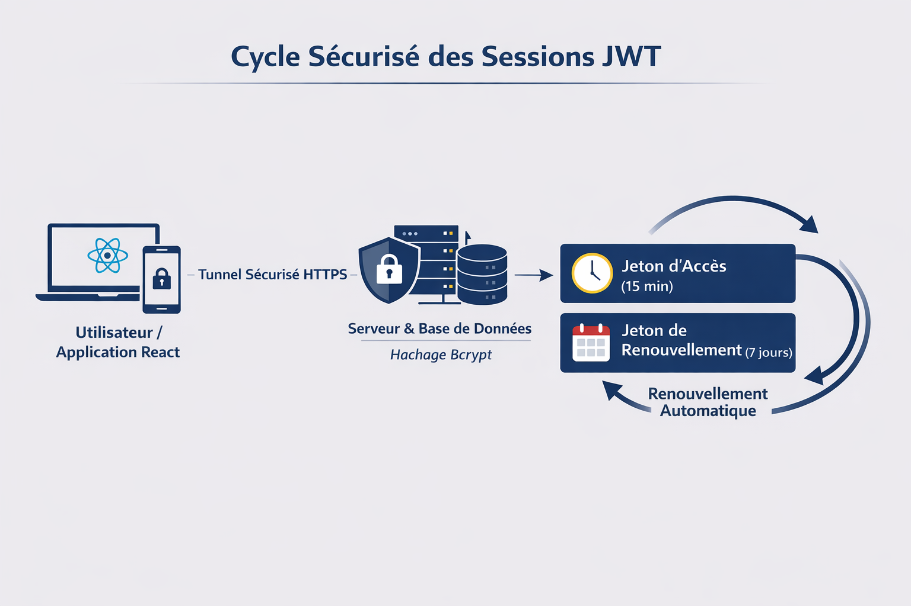
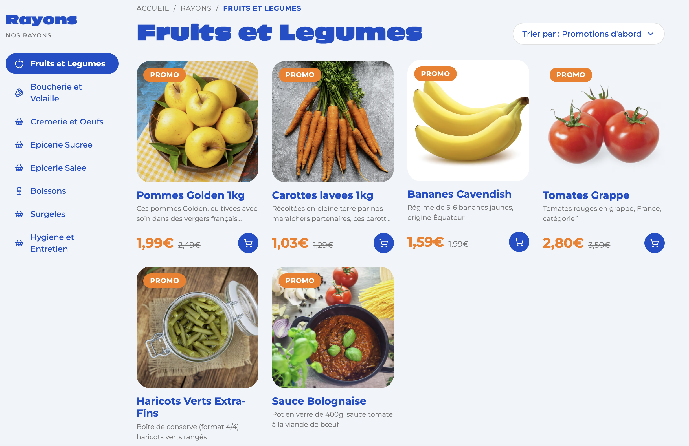

# Politique d’authentification - Lidl Collect

---

## Introduction : une sécurité pensée pour tous

Chez Lidl, la confiance de nos utilisateurs est essentielle. Avec l’application **Lidl Collect**, nous avons conçu un système d’authentification qui protège vos données tout en restant simple à utiliser au quotidien.

Que vous soyez client, préparateur de commandes ou administrateur, chaque accès à la plateforme est sécurisé selon son niveau de sensibilité. Notre objectif est clair : garantir que chacun accède uniquement à ce qui lui est autorisé, tout en assurant une expérience fluide.

Pour construire cette architecture, nous nous appuyons sur les recommandations d’organismes reconnus comme l'**ANSSI**, la **CNIL** et l'**OWASP**.

---

## Comprendre comment vous vous connectez

Lorsque vous vous connectez à Lidl Collect, plusieurs éléments permettent de vérifier votre identité.

Le premier est votre mot de passe, que vous seul connaissez. C’est ce qu’on appelle un **facteur de connaissance**. Dans certains cas, nous demandons également un second élément, comme un code généré sur votre téléphone. Cela correspond à un **facteur de possession**.

Le fait de combiner ces éléments s’appelle l’authentification forte, ou **MFA** (*Multi-Factor Authentication*). Elle est recommandée par l’ANSSI pour protéger les accès sensibles, notamment pour les comptes internes.

---

## Pourquoi nous utilisons les tokens (JWT)

Pour vous permettre de naviguer facilement dans l’application sans avoir à vous reconnecter en permanence, Lidl Collect utilise une technologie appelée **JWT (JSON Web Token)**.

Concrètement, après votre connexion, nous vous attribuons un jeton numérique sécurisé. Ce jeton fonctionne comme un badge temporaire qui prouve votre identité à chaque action.

Ce choix repose sur plusieurs raisons :
1. **Fluidité :** Il permet une navigation rapide, notamment sur mobile.
2. **Performance :** Il évite de stocker des sessions côté serveur, ce qui améliore la stabilité de la plateforme.
3. **Gestion des droits :** Il permet d’intégrer directement votre rôle dans le système.

Cette approche est aujourd’hui largement utilisée et recommandée par les bonnes pratiques de l’OWASP.

---

## Une sécurité renforcée grâce à la gestion des sessions

Le système Lidl Collect repose sur deux types de jetons complémentaires pour garantir sécurité et confort de navigation.

Lors de votre connexion, un premier jeton appelé **Access Token** vous est attribué. Afin de limiter les risques en cas d’interception, sa durée de validité est volontairement courte :
* **15 minutes** pour les clients et les opérateurs.
* **10 minutes** pour les comptes administrateurs (niveau de sécurité plus élevé).

Pour éviter une reconnexion manuelle permanente, un second jeton appelé **Refresh Token** est utilisé pour générer automatiquement un nouvel Access Token. Sa durée de vie est adaptée au profil :
* **7 jours** pour un client (confort d'utilisation).
* **8 heures** pour les opérateurs et managers.
* **4 heures** pour les administrateurs, conformément aux recommandations de sécurité renforcée.

---

## Comment vos mots de passe sont protégés

Chez Lidl Collect, aucun mot de passe n’est stocké tel quel. Nous utilisons une technique appelée **hachage**, qui transforme votre mot de passe en une version illisible et irréversible.

Nous utilisons l’algorithme **Bcrypt**, recommandé par la CNIL. Son avantage principal est qu’il ralentit volontairement les calculs, ce qui rend les attaques par "force brute" extrêmement difficiles.

En complément, nous ajoutons une donnée aléatoire unique appelée **"sel" (salt)** à chaque mot de passe. Cela empêche deux mots de passe identiques d’avoir le même résultat haché en base de données, renforçant encore la protection.

---

## Des accès adaptés à chaque utilisateur (RBAC)

Lidl Collect applique une gestion des accès par rôle :
* **Client :** Accède uniquement à ses commandes et informations personnelles.
* **Opérateur :** Consulte les commandes pour la préparation, sans accès aux données bancaires.
* **Administrateur :** Dispose d’un accès complet aux paramétrages du système.

Cette approche suit le **principe du moindre privilège** recommandé par l’ANSSI.

---

## Protection contre les principales menaces

* **Blocage de compte :** En cas de tentatives répétées (5 échecs), le compte est temporairement bloqué pour stopper les attaques automatisées.
* **Anti-Phishing :** Grâce à la double authentification, même si un mot de passe est volé, l'accès reste protégé.
* **Sécurisation des cookies :** Les jetons sont stockés avec les attributs *HttpOnly* et *Secure* pour empêcher le vol de session via des scripts malveillants.

---

## Votre rôle dans la sécurité

La sécurité est une responsabilité partagée. Nous vous recommandons d’utiliser un mot de passe unique et de ne jamais valider une demande de code dont vous n'êtes pas l'origine.

---

## Conclusion : une sécurité simple et efficace

Grâce à l’utilisation de technologies reconnues (JWT, Bcrypt, MFA), nous protégeons efficacement vos données tout en offrant une expérience utilisateur fluide et moderne.

---

## Sources
* [Recommandations de l'ANSSI](https://messervices.cyber.gouv.fr/documents-guides/anssi-guide-authentification_multifacteur_et_mots_de_passe.pdf)
* [Recommandations de la CNIL](https://www.cnil.fr/fr/mots-de-passe-recommandations-pour-maitriser-sa-securite)
* [Bonnes pratiques de l'OWASP](https://cheatsheetseries.owasp.org/cheatsheets/Authentication_Cheat_Sheet.html)

---

# Partie théorique pour le paiement en ligne

### Stockage des données
Nous avons arbitré entre deux solutions majeures :
* **Chiffrement** : Permet le contrôle total mais présente un risque majeur : si la clé de déchiffrement est volée, toutes les cartes sont exposées.
* **Tokenisation (Choix Lidl Collect)** : La donnée réelle est remplacée par un jeton sans valeur. 
    * *Justification :* C'est le standard recommandé par **IBM** et **Stripe**. En cas de fuite, Lidl ne perd aucune donnée sensible.

### Transport et Interface
* **Protocole TLS 1.2+ (HTTPS) :** Chiffre le "tunnel" entre le client et Lidl. Empêche l'interception de type "Man-in-the-Middle".
* **Intégration par iFrame (Isolation) :** Utilisation des champs sécurisés du prestataire (ex: Stripe Elements). Le numéro de carte ne touche jamais notre code source, ce qui nous protège du **Formjacking**.

### Validation et Fraude
* **Authentification Forte (3D Secure 2) :** Obligation légale de la **DSP2**. Confirmation par biométrie ou application bancaire pour prouver le consentement réel.
* **Machine Learning :** Analyse des comportements suspects en temps réel pour bloquer les fraudes avant le débit.

### Ce que nous "récupérons" et "gardons"
**Nous ne gardons JAMAIS :** Le numéro de carte complet, la date d'expiration ou le **CVV**.

**Nous conservons uniquement :**
* Le **Token de paiement** (pour les futurs achats/remboursements).
* Le statut de la vérification CVV.
* Le **Fingerprint** de l'appareil (lutte anti-fraude).
* Les **4 derniers chiffres** (affichage pour l'utilisateur).

---

# Page coder front

